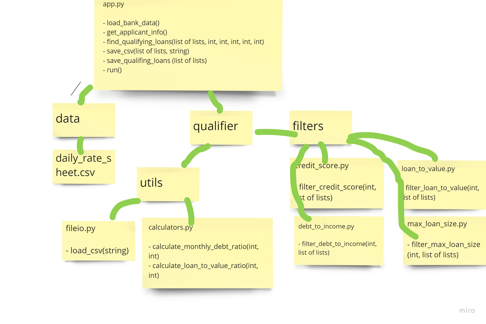

# Find Qualifying Loans

This program reads in a .csv file of bank information and given user input of credit_score, debt, income, loan, home_value, will calculate a users monthly_debt_ratio and loan_to_ratio and use this info to filter back loans that the user can qualify for.  These loans are then outputted to another .csv file.

---

## Technologies

Programming language: Python
Libraries used: sys, fire, questionary, csv, Path(pathlib)

---

## Usage

This Miro board was so, so painful to create size correctly so it could be outputted as an image file.  Please, there has to be something easier.

Aha!  I figured out how to include an image.  (tears of joy)  I needed to move the image into the repository of the program.  I can't just call a random file on my C drive.

There were two functions created, csv_save() and save_qualifying_loan().

csv_save()

'''
{
    def save_csv(qualifying_loans, filename):
    """ A function uses the csv library to save the qualifying data as a file.
    Inputs:
    - qualifying_loans: assuming it is a list of lists
    - output_path: assuming it is a string
    Outputs: 
    - a .csv file should be saved.
    - no arguments are returned.
    Requirements: 
    - the csv package
    Documentation: https://docs.python.org/3/library/csv.html#writer-objects
    """

    with open(filename, 'w', newline='') as csvfile:
        # creating a csv writer object 
        csvwriter = csv.writer(csvfile) 

        try:            
            # writing the list of lists on object qualifying_loans using iteration
            for loan in qualifying_loans:
                csvwriter.writerow(loan)
        except csvwriter.Error as e:
            sys.exit('file {}, line {}: {}'.format(filename, csvwriter.line_num, e))
}
'''

save_qualifying_loans()
'''
{
    def save_qualifying_loans(qualifying_loans):
    """Saves the qualifying loans to a CSV file.

    Args:
        qualifying_loans (list of lists): The qualifying bank loans.
    """
    # @TODO: Complete the usability dialog for savings the CSV Files.
    # YOUR CODE HERE!

    # check to see if there are any qualifying loans
    # if there are no qualifying loans, let the user know and then exit
    if len(qualifying_loans) <= 0:
        sys.exit(f"Oops!  There are no qualifying loans.  Goodbye.")

    # Ask the user if they would like to save the file.
    # If not, gracefully exit.  
    # If the user does want to save the file, prompt them for a filename and path.
    yes_no = questionary.text("Would you like to save the qualifying loans to a file? (y/n)").ask()

    if yes_no == "n":
        sys.exit(f"You have chosen not to save the file.  Goodbye.")
    elif yes_no != "y":
        sys.exit(f"Sorry, we don't recognize that command: {yes_no}.  Goodbye")

    # Prompt the user for a file path to save the file
    csvpath = questionary.text("Please enter a file path to save the list of qualifying loans to (.csv):").ask()
    csvpath = Path(csvpath)

    # add a *.csv extension to the file name stem, just to make sure it is a .csv type of file
    csvpath = csvpath.stem + ".csv"

    # Add a header row to qualifying_loans-=.
    # The header is the same info as the input file (Lender,Max Loan Amount,Max LTV,Max DTI,Min Credit Score,Interest Rate).
    qualifying_loans.insert(0, ["Lender","Max Loan Amount","Max LTV","Max DTI","Min Credit Score","Interest Rate"])
    # Now that we have a valid file name to save to, call the save_csv fuction to actually create and save the *.csv file
    save_csv(qualifying_loans, csvpath)

}
'''

---

## Installation

Install Python.

---

## Contributing

UW FinTech Boot Camp 2021 provided most of the files.  The only functions that I created were csv_save(), save_qualifying_loan() and this README file.

Pull requests are welcome. For major changes, please open an issue first to discuss what you would like to change.

---

## License

Copyright (c) 2010, Lisa Bailey (balllisaann@yahoo.com)
